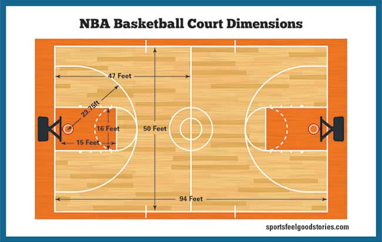

<br/>       
**Alex Pollock**<br/><br/>           

**Introduction**    
In this tutorial I will be showing you how to try and answer the question of who were the best NBA shooting teams of the 2014-2015 season using data science techniques including data curation, data parsing, data management, exploratory data analysis, hypothesis testing, and machine learning. <br/>

I will be using two datasets to help me answer this question. The datasets can be found at https://www.kaggle.com/dansbecker/nba-shot-logs/data. <br/>

**Project Outline**  
1. Gathering the data <br/>
2. Tidying the data <br/>
3. Exploratory Data Analysis <br/>
4. Hypothesis Testing <br/>


**Part 1. Gathering The Data**    
First we will need the data so we will download the dataset from https://www.kaggle.com/dansbecker/nba-shot-logs/data. The dataset is a CSV or comma seperated file which can be read using [read_csv()](https://readr.tidyverse.org/reference/read_delim.html). When read_csv() reads in the file it will create a [dataframe](http://www.r-tutor.com/r-introduction/data-frame) which is a table of data. 

```{r setup, include=FALSE}
library(tidyverse)
library(ggplot2)
library(dbplyr)
library(lubridate)
```

```{r load data, include=TRUE, echo=FALSE}
season_stats_df <- read_csv("shot_logs.csv")
head(season_stats_df, n=10)
```

<br/> <br/>
**2. Tidying The Data**  
When working with tidy data we assume that:<br/>
1. Each attribute or variable forms a column. <br/>
2. Each entity or observation forms a row. <br/>
3. Each type of entity or observational unit forms a table <br/><br/> 

The data might not always be easy to read or clean. Some problems with messy data include column headers being values, multiple variables being stored in one column, variables being stored in both rows and columns, multiple types of observational units being stored in the same table, and single observational units being stored in multiple tables.<br/>

Fortunately, the dataset we are working with is pretty tidy already. All the variables are in there own columns, the observations are in rows, and there are not much missing data. To tidy the data a little we will remove some of the columns that we will not need when doing analysis. We will also rearrange the columns to make it easier to read.<br/>

```{r tidy data, include=TRUE}
remove_cols <- c("GAME_ID", "MATCHUP", "LOCATION")
season_stats_df <- season_stats_df[ , !(names(season_stats_df) %in% remove_cols)]

season_stats_df <- season_stats_df[, c("player_name", "player_id", "SHOT_NUMBER", "PERIOD", "GAME_CLOCK", "SHOT_CLOCK", "DRIBBLES", "TOUCH_TIME", "SHOT_DIST", "PTS_TYPE", "SHOT_RESULT", "FGM", "PTS", "CLOSEST_DEFENDER", "CLOSEST_DEFENDER_PLAYER_ID", "CLOSE_DEF_DIST", "W", "FINAL_MARGIN")]
head(season_stats_df, n = 10)
```
<br/>
Next we will remove NA or missing values and convert the GAME_CLOCK column to seconds to make it easier to use later on. To remove NA we will use [is.na()](https://www.programmingr.com/tutorial/is-na/) function.

```{r tidy data2, include=TRUE}
season_stats_df$SHOT_CLOCK[is.na(season_stats_df$SHOT_CLOCK)] <- 0.0
season_stats_df$GAME_CLOCK <- season_stats_df$GAME_CLOCK / 60
head(season_stats_df, n = 10)
```
<br/>


Finally we will create a new column to determine the type of shot that was taken based on the shot distance and points type. If the points is 3 then the shot is a 3 pointer. If the shot distance is less than 2 feet away from the basket it will be considered a dunk or layup, less than 10 feet away it will be considered a shot iniside the paint.
<br/>


