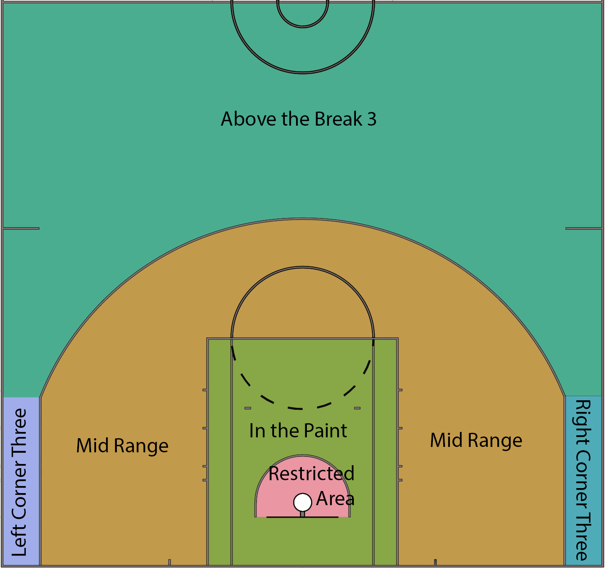

#### Alex Pollock       

### Introduction    
In this tutorial I will be showing you how to try and answer the question of who were the best NBA shooting teams of the 2014-2015 season using data science techniques including data curation, data parsing, data management, exploratory data analysis, hypothesis testing, and machine learning. <br/>

I will be using two datasets to help me answer this question. The datasets can be found at https://www.kaggle.com/dansbecker/nba-shot-logs/data. <br/>

### Project Outline
1. Gathering the data <br/>
2. Tidying the data <br/>
3. Exploratory Data Analysis <br/>
4. Hypothesis Testing <br/>
5. Conclusion <br/>


### Part 1. Gathering The Data
First we will need the data so we will download the dataset from https://www.kaggle.com/dansbecker/nba-shot-logs/data. The dataset is a CSV or comma separated file which can be read using [read_csv()](https://readr.tidyverse.org/reference/read_delim.html). When read_csv() reads in the file it will create a [dataframe](http://www.r-tutor.com/r-introduction/data-frame) which is a table of data. 

```{r setup, include=FALSE}
library(tidyverse)
library(ggplot2)
library(dbplyr)
library(lubridate)
library(stringr)
library(hexbin)
library(RColorBrewer)
```

```{r load data, include=TRUE, echo=FALSE}
season_stats_df <- read_csv("shot_logs.csv")
head(season_stats_df, n=10)
```
### 2. Tidying The Data 
When working with tidy data we assume that:<br/>
1. Each attribute or variable forms a column. <br/>
2. Each entity or observation forms a row. <br/>
3. Each type of entity or observational unit forms a table <br/><br/> 

The data might not always be easy to read or clean. Some problems with messy data include column headers being values, multiple variables being stored in one column, variables being stored in both rows and columns, multiple types of observational units being stored in the same table, and single observational units being stored in multiple tables.<br/>

Fortunately, the dataset we are working with is pretty tidy already. All the variables are in their own columns, the observations are in rows, and there is not much missing data. To tidy the data a little we will remove some of the columns that we will not need when doing analysis. We will also rearrange the columns to make it easier to read.<br/>

```{r tidy data, include=TRUE}
remove_cols <- c("GAME_ID", "LOCATION")
season_stats_df <- season_stats_df[ , !(names(season_stats_df) %in% remove_cols)]

season_stats_df <- season_stats_df[, c("player_name", "player_id", "MATCHUP", "SHOT_NUMBER", "PERIOD", "GAME_CLOCK", "SHOT_CLOCK", "DRIBBLES", "TOUCH_TIME", "SHOT_DIST", "PTS_TYPE", "SHOT_RESULT", "FGM", "PTS", "CLOSEST_DEFENDER", "CLOSEST_DEFENDER_PLAYER_ID", "CLOSE_DEF_DIST", "W", "FINAL_MARGIN")]
head(season_stats_df, n = 10)
```
<br/>
Next we will remove NA or missing values, change the matchup column to the team, and convert the GAME_CLOCK column to seconds to make it easier to use later on. To remove NA we will use [is.na()](https://www.programmingr.com/tutorial/is-na/) function. To change the matchup column to the team the player plays for we will use [substring()](https://stat.ethz.ch/R-manual/R-devel/library/base/html/substr.html) to get the team abbreviation and then change the column name to TEAM using [names()](https://www.datanovia.com/en/lessons/rename-data-frame-columns-in-r/).

```{r tidy data2, include=TRUE}
season_stats_df$SHOT_CLOCK[is.na(season_stats_df$SHOT_CLOCK)] <- 0.0
season_stats_df$GAME_CLOCK <- season_stats_df$GAME_CLOCK / 60
season_stats_df$MATCHUP <- substring(season_stats_df$MATCHUP, 15, 18)
names(season_stats_df)[names(season_stats_df) == "MATCHUP"] <- "TEAM"
head(season_stats_df, n = 10)
```
<br/>
 
<br/><br/>
Here I include an image of a NBA basketball court and its dimensions to help familiarize you with the different dimensions. The paint area is the area shaded in orange on both sides of the court and is about 15 feet by 16 feet. The three point line is the line around the basket that is 23.75 feet away. Any shot behind this line is called a three pointer because of the fact that the shot is worth three points. Anyshot made inside the three point line is worth two points. <br/>

Finally we will create a new column to determine the type of shot that was taken based on the shot distance and points type. If the points are 3 then the shot is a three pointer. If the shot distance is 2 feet away from the basket or less it will be considered a dunk or layup, 10 feet away or less it will be considered a shot in the paint, more than 10 feet away and less than 17 or equal to will be a mid range shot, and any shot greater than 17 feet and 2 points type will be a long range two shot.
```{r Shot Classification, include=FALSE}
season_stats_df$TYPE_OF_SHOT[season_stats_df$PTS_TYPE == 3] <- "Three Pointer" 
season_stats_df$TYPE_OF_SHOT[season_stats_df$SHOT_DIST <= 2] <- "Layup / Dunk"
season_stats_df$TYPE_OF_SHOT[season_stats_df$SHOT_DIST <= 10 & season_stats_df$SHOT_DIST > 2] <- "In the Paint"
season_stats_df$TYPE_OF_SHOT[season_stats_df$SHOT_DIST > 10  & season_stats_df$SHOT_DIST <= 17] <- "Mid Range"
season_stats_df$TYPE_OF_SHOT[season_stats_df$SHOT_DIST > 17  & season_stats_df$PTS_TYPE == 2] <- "Long Two"
head(season_stats_df, n = 10)
```

### 3. Exploratory Data Analysis
Now that the data is tidy and easily readable and understandable we will do some analysis. This will help us to better understand our data and help us make decisions about statistical and machine learning methods. We will use both visualizations and statistical methods to help us learn about general trends in the data. <br/>

#### 3.1 Some NBA Statistics
First we will take a look at some statistics regarding teams with the highest field goal percentage. We first create a new data frame called team_fgpct_df which includes the number of made, missed, and total shots by each team. To find the total number of shots made and missed we will use [group_by()](https://dplyr.tidyverse.org/reference/group_by.html) which splits data into groups by each team and [summarise()](https://www.rdocumentation.org/packages/dplyr/versions/0.7.8/topics/summarise) which collapses each group into a single-row summary so we have data for teams rather than individual players. Once we have the made and missed shots for each team we can add them together to get the total. And finally we divide the shots made by the total to get the field goal percentage for each team. We display the output from highest to lowest in terms of field goal percentage. 

```{r Team FG PCT, include=TRUE}
team_fgpct_df <- data.frame()

team_fgpct_df <- season_stats_df %>%
  group_by(TEAM) %>%
  summarise(sum(SHOT_RESULT == "made"), sum(SHOT_RESULT == "missed"))
names(team_fgpct_df)[names(team_fgpct_df) == "sum(SHOT_RESULT == \"made\")"] <- "Made"
names(team_fgpct_df)[names(team_fgpct_df) == "sum(SHOT_RESULT == \"missed\")"] <- "Missed"
team_fgpct_df$Total <- team_fgpct_df$Made + team_fgpct_df$Missed
team_fgpct_df$FG_PCT <- team_fgpct_df$Made / team_fgpct_df$Total

head(team_fgpct_df[order(-team_fgpct_df$FG_PCT),])
```
<br/>
Now we will take a look at the teams with the highest average margin of victory. To do this we will create a new dataframe called team_final_margin_df and use the [select()](https://www.rdocumentation.org/packages/dplyr/versions/0.7.8/topics/select) statement to select only columns player_name, TEAM, and FINAL_MARGIN from season_stats_df and the [distinct()](https://www.rdocumentation.org/packages/dplyr/versions/0.7.8/topics/distinct) function to get only unique values. This allows to see each player, the team their on and all of their games final margin of victories. Then we use group_by(), grouping by player_name and TEAM, along with summarise() to get the total final margin of victory for all 30 teams. Once we have this we will rename the column to help better understand the data frame when outputting and then divide the final margin by 82 to get an average margin of victory per game. Last we output the values in decreasing order.
```{r}
team_final_margin_df <- data.frame()
  
team_final_margin_df <- season_stats_df %>%
  select(player_name, TEAM, FINAL_MARGIN) %>%
  distinct()

team_final_margin_df <- team_final_margin_df %>%
  group_by(player_name, TEAM) %>%
  summarise(sum(FINAL_MARGIN))

names(team_final_margin_df)[names(team_final_margin_df) == "sum(FINAL_MARGIN)"] <- "FINAL_MARGIN"

team_final_margin_df <- team_final_margin_df %>%
  group_by(TEAM) %>%
  summarise(sum(FINAL_MARGIN) / 82)

names(team_final_margin_df)[names(team_final_margin_df) == "sum(FINAL_MARGIN)/82"] <- "FINAL_MARGIN"
head(team_final_margin_df[order(-team_final_margin_df$FINAL_MARGIN),])
```
<br/> 
Here we can see that pretty much the teams with the highest field goal percentages have the largest average margin of victory which makes sense because the more shots a team makes, usually translates to more points and larger margins of victory. 


#### 3.2 Finding Trends in Our Data
Now we will see if we can find any interesting trends in our data by doing data visualization and statistical analysis. If you aren't familiar with a basketball court and the shot locations I have included an image here that shows the different spots on the court. 
 
<br/>
To visual our data we will use [ggplot()](https://www.statmethods.net/advgraphs/ggplot2.html). With ggplot() we can construct a boxplot to show the frequencies of each type of shot.
```{r boxplot shot locations, include=TRUE}
season_stats_df %>%
  ggplot(aes(TYPE_OF_SHOT, fill = TYPE_OF_SHOT)) + geom_bar() + xlab("Type of Shot") + ylab("Frequency")
```
<br/>
From our graph we can see that shots in the paint and three pointers are the most frequently taken shots. This makes sense because shots in the paint are close to the basket and three pointers are worth the most points. <br/> <br/>

Now we can look at the percentages of each of these shots to see if the players shot selections make sense.
```{r shot type pct, include=TRUE}
shot_type_pct <- data_frame()

shot_type_pct <- season_stats_df %>%
  select(TYPE_OF_SHOT, FGM)

shot_type_pct <- shot_type_pct %>%
  group_by(TYPE_OF_SHOT, FGM) %>%
  tally() %>%
  spread(FGM, n)

shot_type_pct$Total <- shot_type_pct$'0' + shot_type_pct$'1'
shot_type_pct$FG_PCT <- shot_type_pct$'1' / shot_type_pct$Total

head(shot_type_pct[order(-shot_type_pct$FG_PCT),])
```
<br/>
From our results we can see that layup/dunk has the highest field goal percentage while three pointer has the lowest field goal percentage. And this makes sense because the closer you are to the basket the easier the shot is going to be to make. Therefore, the percentages decrease with distance away from the basket. <br/>

Now we will take a look at the average amount of points a player is expected to score based on the distance away from the basket. To do this we will simply take the FG_PCT and multiply it by the number of points allocated for that shot, which is 2 points for all shots except three pointers which is 3 points. 
```{r avg points exp, include=TRUE}
total_shots <- sum(shot_type_pct$Total)
shot_type_pct$PCT_OF_TOTAL <- shot_type_pct$Total / total_shots
shot_type_pct$POINTS_EXP <- shot_type_pct$FG_PCT * 2.0
shot_type_pct$POINTS_EXP[5] <- shot_type_pct$FG_PCT * 3.0
shot_type_pct
```
<br/>
From our results we can see that, again, the closer the shot is the more points expected because of the difficulty of the shot. To help us see this visually we can plot the points expected per shot by the percentage that those shots are taken. 

```{r plot points exp vs. pct of total, include=TRUE}
shot_type_pct %>%
  ggplot(aes(x = POINTS_EXP, y = PCT_OF_TOTAL, label = TYPE_OF_SHOT)) + geom_point() + labs(title = "Points Expected Per Shot vs. Percentage Shots are Taken", x = "Points Expected", y = "Percent of Total") + geom_text(aes(label=TYPE_OF_SHOT),hjust=1, vjust=1)
```
<br/>
From our graph we can see that layups and dunks are going to yield the most points per shot for 2 pointers because they have the highest field goal percentage. However, they are the lowest percentage of the total shots taken. This means that for some reason players are not taking advantage of the easiest shot that yields the most expected points relative to the points given for that shot. An interesting point to notice is that three pointers are a high percentage of the shots taken compared to long twos, mid range shots, and layups or dunks. I think this shows that players are willing to take three pointers because the shot is more effective, given that its worth three points instead of 2, and if a player can shoot that shot relatively well then why not take it. <br/><br/>

Now let's take a look at an individual team's points per shot and percentage of shots taken. We will look at the Golden State Warriors, probably the best overall team during the 2014-2015 NBA season. 

```{r GSW, include=TRUE}
GSW_shots <- data_frame()

GSW_shots <- season_stats_df %>%
  select(TEAM, TYPE_OF_SHOT, FGM)

GSW_shots <- GSW_shots %>%
  group_by(TEAM, TYPE_OF_SHOT, FGM) %>%
  tally() %>%
  spread(FGM, n)

GSW_shots$Total <- GSW_shots$'0' + GSW_shots$'1'
GSW_shots$FG_PCT <- GSW_shots$'1' / GSW_shots$Total

GSW <- GSW_shots %>%
  filter(Total == 1503 | Total == 340 | Total == 634 | (Total == 577 & FG_PCT > 0.39) | Total == 1499)

GSW
```
<br/>
Here we can see that the Golden State Warriors take a majority of their shots either in the paint or from three. Next we will see this visually like we did for the entire NBA. 
```{r GSW graph, include=TRUE}
total_shots <- sum(GSW$Total)
GSW$PCT_OF_TOTAL <- GSW$Total / total_shots
GSW$POINTS_EXP <- GSW$FG_PCT * 2.0
GSW$POINTS_EXP[5] <- GSW$FG_PCT * 3.0
GSW %>%
  ggplot(aes(x = POINTS_EXP, y = PCT_OF_TOTAL, label = TYPE_OF_SHOT)) + geom_point() + labs(title = "Points Expected Per Shot vs. Percentage Shots are Taken", x = "Points Expected", y = "Percent of Total") + geom_text(aes(label=TYPE_OF_SHOT),hjust=1, vjust=1)
```
<br/>
Golden State's graph is a little different than the rest of the NBA. The most obvious difference is that they shoot a lot more three pointers. This shows that they are willing to shoot more threes than any other shot. As a result, they made more threes, scored more points, and won more games. Thus, the Golden State Warriors had the best strategy to help them win games. 

#### 3.3 Visualizing Shooting Data
In this section we will take a look at some more advanced data visualization. A question we may want to answer is does the shot distance depend at all on the time left in a game. 

To do this we will use a [hexbin()](https://www.rdocumentation.org/packages/hexbin/versions/1.29.0/topics/hexbin) to create a heatmap showing the time left on the clock versus the shot distance for the Golden State Warriors.
```{r heatmap, include=TRUE}
stats <- season_stats_df %>%
  filter(str_detect(TEAM, "GSW")) %>%
  select(SHOT_DIST, GAME_CLOCK)

stats$GAME_CLOCK <- as.numeric(stats$GAME_CLOCK)

bin<-hexbin(stats$GAME_CLOCK, stats$SHOT_DIST, xbins=50)
my_colors=colorRampPalette(rev(brewer.pal(11,'Spectral')))
plot(bin, xlab="Time on Clock", ylab="Shot Distance", main="Golden State Warrior's Shot Map Based On Game Time" , colramp=my_colors , legend=F)
```
<br/>
From the graph we can see that lighter blues, reds, and yellows show the higher density regions and the darker colors show the less dense regions. It appears that over time shot distances stay relatively the same being mostly populated in the 25 foot range and less than 5 feet range. These two distances correspond to three pointers and shots in the paint respectively.<br/> 

Now we will see how these results compare to all the teams in the NBA. 
```{r, include=TRUE}
stats <- season_stats_df %>%
  select(GAME_CLOCK, SHOT_DIST)

stats$GAME_CLOCK <- as.numeric(stats$GAME_CLOCK)

bin<-hexbin(stats$GAME_CLOCK, stats$SHOT_DIST, xbins=50)
my_colors=colorRampPalette(rev(brewer.pal(11,'Spectral')))
plot(bin, xlab="Time Left on Shot Clock", ylab="Shot Distance", main="NBA Shot Map" , colramp=my_colors , legend=F)
```
<br/> 
We can see that the results are pretty much the same. An interesting trend in the graph is that with just about 0 seconds left on the clock there are a lot more shots at all distances. This is probably because at the end of a game players are shooting from any distance, especially when games are close to try and score at the last second. 

### 4. Hypothesis Testing
Now we will use our statistics to test if the NBA shooting percentage in the last minutes of the game is different from the entire game.
More specifically, we will use hypothesis testing. To learn more about hypothesis testing you can check [here](https://www.statisticshowto.com/probability-and-statistics/hypothesis-testing/). The hypothesis test that we will be using is a t-test which tests if two means are equal. To learn more about t-tests you can check [here](https://www.investopedia.com/terms/t/t-test.asp).<br/>

First we will create a new data frame that includes data only in the last mintue of games for all teams including the field goal or shooting percentage.
```{r}
team_fgpct_last_min <- data.frame()

team_fgpct_last_min <- season_stats_df %>%
  filter(GAME_CLOCK <= 60) %>%
  group_by(TEAM) %>%
  summarise(sum(SHOT_RESULT == "made"), sum(SHOT_RESULT == "missed"))
names(team_fgpct_last_min)[names(team_fgpct_last_min) == "sum(SHOT_RESULT == \"made\")"] <- "Made"
names(team_fgpct_last_min)[names(team_fgpct_last_min) == "sum(SHOT_RESULT == \"missed\")"] <- "Missed"
team_fgpct_last_min$Total <- team_fgpct_last_min$Made + team_fgpct_last_min$Missed
team_fgpct_last_min$FG_PCT <- team_fgpct_last_min$Made / team_fgpct_last_min$Total
team_fgpct_last_min
```
<br/> 
Now that we have this new data frame we can perform our t-test. Our null hypothesis will be that the field goal percentages are equal. Our alternative hypothesis will be that the field goal percentages are different.  
```{r hypo test, include=TRUE}
t.test(team_fgpct_df$FG_PCT, team_fgpct_last_min$FG_PCT)
```
<br/>
From the output we can see the test statistic value is 8.5776 and the p-value is 4.135e-11. Since our p-value is less than 0.05, which is our alpha value, we reject the null hypothesis. Therefore, the field goal percentages are different for the last minute of a game and the entire game. In the last minute of games, players are shooting at a significantly lower field goal percentage.
<br/>

### 5. Conclusion
In the end, the entire NBA continues to look for ways to improve the game, get the most out of players, and win the most games while spending the least amount of money. Statistics are becoming essential to organizations and hiring individuals to be able to analyze this data is a major aspect of the business today. We've seen this statistical approach being taken by MLB teams and we are starting to see it spread across other sports as well as football, basketball, and soccer. By looking at the field goal percentages of the teams, and the points expected per shot we saw that the Golden State Warriors were the best shooting team and as a result won the most games that season. Their approach to shooting a high percentage of three pointers was an effective strategy.

The dataset we worked with contains a lot of data and there is a lot more interesting things we can do with it. The possibilities are endless and I encourage everyone to complete their own experiements with this data.
